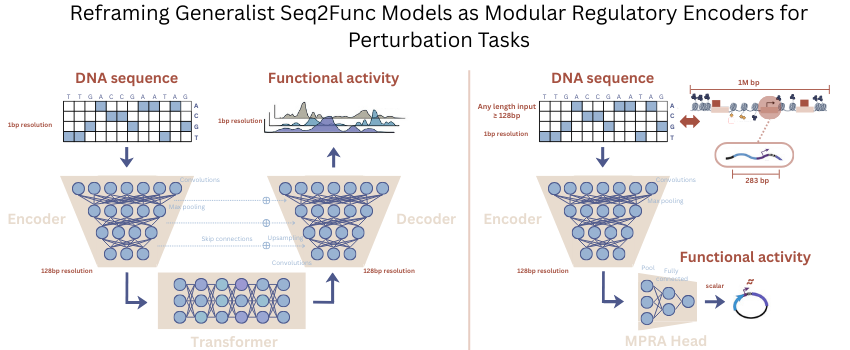

# Generalist Seq2Func Models as Modular Regulatory Encoders for Perturbation Tasks



## Generalist Seq2Func Models for MPRA Finetuning

This repository demonstrates finetuning **generalist seq2func models** (AlphaGenome, Enformer, and others) on MPRA (Massively Parallel Reporter Assay) data. The modular approach shown here can be applied to **any generalist seq2func model** that provides sequence embeddings, making it a flexible framework for regulatory sequence prediction tasks.

The goal is to think of any pretrained generalist model as **modular components** that can be used separately for their _cis_-regulatory logic. Here we finetuned the generalists' encoders to predict reporter activity from genomic sequences, applying it to lentiMPRA and DeepSTARR datasets and evaluating performance zero-shot on CAGI5 data. 

This approach leverages the rich sequence representations learned by large-scale generalist models while adapting them to specific regulatory tasks through task-specific prediction heads.

## Installation

### Prerequisites

1. **For AlphaGenome models**: Install AlphaGenome Research:
```bash
pip install git+https://github.com/google-deepmind/alphagenome_research.git
```

2. **For Enformer models**: Install Enformer PyTorch:
```bash
pip install enformer-pytorch
```

3. Install this project:
```bash
git clone https://github.com/Al-Murphy/alphagenome_FT_MPRA.git
cd alphagenome_FT_MPRA
pip install -e .
```

This will automatically install the `alphagenome-ft` package as a dependency (for AlphaGenome models) and other required packages.

## Contents

- **Overview**
  - [Architecture](#architecture)
  - [Quick Start](#quick-start)
- **Code Guides**
  - [Source utilities (`src/`)](src/README.md)
  - [Training / evaluation scripts (`scripts/`)](scripts/README.md)
  - [Config files (`configs/`)](configs/README.md)


## Architecture

### Modular Encoder Approach

This project demonstrates a **modular approach** to using generalist seq2func models:

```
DNA Sequence (B, S, 4)
    ↓
Generalist Model Backbone (frozen)
    ├── AlphaGenome: Encoder → Transformer → Decoder
    ├── Enformer: Convolutional blocks → Transformer → Output heads
    └── Other seq2func models...
    ↓
Sequence Embeddings (extracted from backbone)
    ├── High-resolution embeddings (1bp)
    ├── Low-resolution embeddings (128bp)
    └── Architecture-specific features
    ↓
Custom Task-Specific Heads (trainable)
    ├── MPRAHead: Reporter activity prediction
    ├── DeepSTARRHead: Enhancer activity prediction
    └── YOUR_CUSTOM_HEAD ← Add here
```

### Supported Models

1. **AlphaGenome**: 
   - Multi-resolution embeddings (1bp, 128bp, pairwise)
   - Uses [`alphagenome-ft`](https://github.com/Al-Murphy/alphagenome_ft) for finetuning utilities
   - See that repository for documentation on custom heads, parameter freezing, and model wrapping

2. **Enformer**:
   - Encoder-level embeddings at 128bp resolution
   - PyTorch implementation with custom heads
   - See `src/enf_utils.py` for Enformer-specific utilities

3. **Other Generalist Models**:
   - The modular approach can be extended to any seq2func model
   - Key requirement: ability to extract sequence embeddings from the backbone
   - Custom heads can be implemented following the same pattern

### Fine-tuning Strategy

1. **Backbone**: Freeze pretrained generalist model (encoder/transformer layers)
2. **Embeddings**: Extract multi-resolution sequence representations
3. **Heads**: Train task-specific prediction layers on top of frozen embeddings

This approach allows leveraging rich pretrained representations while efficiently adapting to new tasks.


## Quick Start

### AlphaGenome Example

```python
import jax
import jax.numpy as jnp
from alphagenome_research.model import dna_model
from alphagenome.models import dna_output
from alphagenome_ft import (
    CustomHead,
    HeadConfig,
    HeadType,
    register_custom_head,
    wrap_pretrained_model,
    add_custom_heads_to_model,
)
from src.mpra_heads import MPRAHead

# 1. Register custom MPRA head
register_custom_head(
    'mpra_head',
    MPRAHead,
    HeadConfig(
        type=HeadType.GENOME_TRACKS,
        name='mpra_head',
        output_type=dna_output.OutputType.RNA_SEQ,
        num_tracks=1,
        metadata={'center_bp': 128, 'pooling_type': 'flatten', 'embedding_mode': '1bp'}
    )
)

# 2. Load pretrained model and add MPRA head
base_model = dna_model.create_from_kaggle('all_folds')
model = wrap_pretrained_model(base_model)
model = add_custom_heads_to_model(model, custom_heads=['mpra_head'])

# 3. Freeze backbone for finetuning
model.freeze_backbone()

# 4. Train on your MPRA data
# See scripts/finetune_mpra.py for complete training example
```

### Enformer Example

```python
import torch
from enformer_pytorch import from_pretrained
from src.enf_utils import EncoderMPRAHead

# 1. Load pretrained Enformer
enformer = from_pretrained('EleutherAI/enformer-official-rough', use_tf_gamma=False)

# 2. Create model with custom MPRA head
model = EncoderMPRAHead(
    enformer=enformer,
    num_tracks=1,
    center_bp=256,
    pooling_type='sum'
)

# 3. Freeze Enformer backbone (only train head)
model.freeze_backbone()

# 4. Train on your MPRA data
# See scripts/finetune_enformer_mpra.py for complete training example
```

### Using Configuration Files

For both AlphaGenome and Enformer, you can use pre-configured hyperparameters:

```bash
# AlphaGenome with LentiMPRA
python scripts/finetune_mpra.py --config configs/mpra_HepG2.json

# Enformer with LentiMPRA
python scripts/finetune_enformer_mpra.py --config configs/mpra_HepG2.json

# AlphaGenome with DeepSTARR
python scripts/finetune_starrseq.py --config configs/starrseq.json

# Enformer with DeepSTARR
python scripts/finetune_enformer_starrseq.py --config configs/starrseq.json
```

## Project Structure

```
alphagenome_FT_MPRA/
├── src/                      # Source code
│   ├── mpra_heads.py         # Custom prediction heads (MPRAHead, EncoderMPRAHead, DeepSTARRHead)
│   ├── enf_utils.py          # Enformer-specific utilities and heads
│   ├── data.py               # Data loading classes (LentiMPRADataset, DeepSTARRDataset)
│   ├── seq_loader.py         # Sequence loading utilities
│   ├── training.py            # Training utilities and helpers
│   └── __init__.py
├── scripts/                  # Executable training and evaluation scripts
│   ├── finetune_mpra.py      # Finetune AlphaGenome on LentiMPRA
│   ├── finetune_enformer_mpra.py  # Finetune Enformer on LentiMPRA
│   ├── finetune_starrseq.py  # Finetune AlphaGenome on DeepSTARR
│   ├── finetune_enformer_starrseq.py  # Finetune Enformer on DeepSTARR
│   ├── test_ft_model_*.py    # Evaluation scripts for finetuned models
│   ├── test_cagi5_zero_shot_*.py  # Zero-shot evaluation on CAGI5 benchmark
│   ├── compute_attributions_lentimpra.py  # Attribution analysis (DeepSHAP, gradients)
│   ├── compute_attributions_starrseq.py  # Attribution analysis (DeepSHAP, gradients)
│   ├── cache_embeddings.py   # Pre-compute embeddings for faster training
│   ├── create_mpra_comparison_table.py  # Generate performance comparison tables
│   └── README.md             # Script documentation
├── configs/                  # Hyperparameter configuration files
│   ├── mpra_HepG2.json       # Optimal config for HepG2 cell line
│   ├── mpra_K562.json        # Optimal config for K562 cell line
│   ├── mpra_WTC11.json       # Optimal config for WTC11 cell line
│   ├── starrseq.json         # Optimal config for DeepSTARR dataset
│   └── README.md             # Config file documentation
├── data/                     # Datasets
│   ├── legnet_lentimpra/     # LentiMPRA training data
│   ├── deepstarr/            # DeepSTARR dataset
│   ├── cagi5/                # CAGI5 benchmark data
│   └── motifs/               # Motif analysis data
├── results/                  # Training outputs and evaluations
│   ├── models/               # Saved model checkpoints
│   ├── benchmark_*.csv       # Benchmark results
│   ├── plots/                # Generated plots and figures
│   └── mpralegnet_predictions/  # LegNet baseline predictions
├── assets/                    # Images and figures
│   └── images/
│       └── modular_generalists.png
├── test.ipynb                # Example notebook
├── main.py                   # Entry point
├── pyproject.toml            # Project dependencies
└── README.md                 # This file
```

## Key Features

- **Model-Agnostic Design**: Works with any generalist seq2func model (AlphaGenome, Enformer, etc.)
- **Modular Architecture**: Separate frozen backbones from trainable task-specific heads
- **Multiple Datasets**: Support for LentiMPRA (multiple cell lines) and DeepSTARR
- **Flexible Embedding Access**: Use different resolution embeddings (1bp, 128bp, encoder-only)
- **Two-Stage Training**: Optional cached-embedding training for faster iteration
- **Comprehensive Evaluation**: Zero-shot benchmarks, attribution analysis, and comparison tables
- **Production-Ready Configs**: Pre-optimized hyperparameters for each dataset/cell line

## Extending to Other Models

To add support for another generalist seq2func model:

1. **Extract Embeddings**: Implement a function to extract sequence embeddings from your model
2. **Create Custom Head**: Implement a head class (see `src/mpra_heads.py` for examples)
3. **Wrap Model**: Create a wrapper that freezes the backbone and exposes embeddings
4. **Add Training Script**: Follow the pattern in `scripts/finetune_*.py`

The key principle is: **freeze the generalist backbone, train only the task-specific head**.

## License

This project extends AlphaGenome and uses Enformer. Please refer to the original licenses:
- AlphaGenome: See [AlphaGenome Research license](https://github.com/google-deepmind/alphagenome_research)
- Enformer: See [Enformer license](https://github.com/deepmind/deepmind-research/tree/master/enformer)
